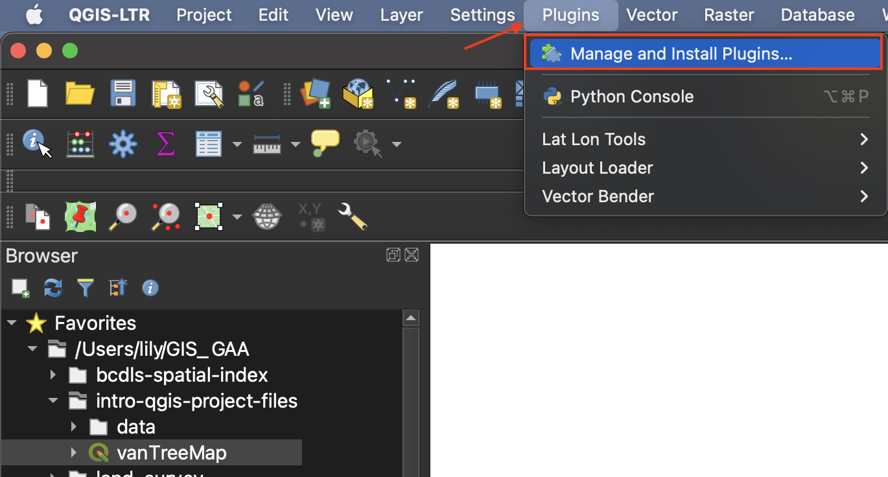

# Add a basemap from a web plugin
Adding a basemap helps give your map data spatial context. 

## 1. Install Plugin
[QGIS plugins](https://plugins.qgis.org/) are user developed tools that extend QGIS functionality beyond the basics. To access basemaps, we'll first install the QuickMapServices plugin. Click on the **Plugin** menu at the top of your screen and select **Manage and Install Plugins...**
   

In the dialogue box that opens, select **All** as a search category on the left and type "QuickMapServices" as one word. Install the plugin and close the dialogue box.

## 2. Enable Plugin
Now go to the **Web** menu at the top of your screen. You should see the QuickMapServices plugin. Hover over it and click "Settings" at the bottom of the menu that pops up. In the settings dialogue box go to the "More services" tab and click "Get contributed pack." Click **save** to close settings.

## 3. Add Basemap
Return to the **Web** menu. This time when you hover over the QuickMapServices plugin you will see an array of basemap options. Select OpenStreetMap as your basemap. Like QGIS, [Open Street Map (OSM)](https://www.openstreetmap.org/about) is open source and user developed.   

Make sure to drag your basemap to the bottom in your Layers Panel. Remove the basemap at anytime by right clicking the layer and selecting "remove." 

