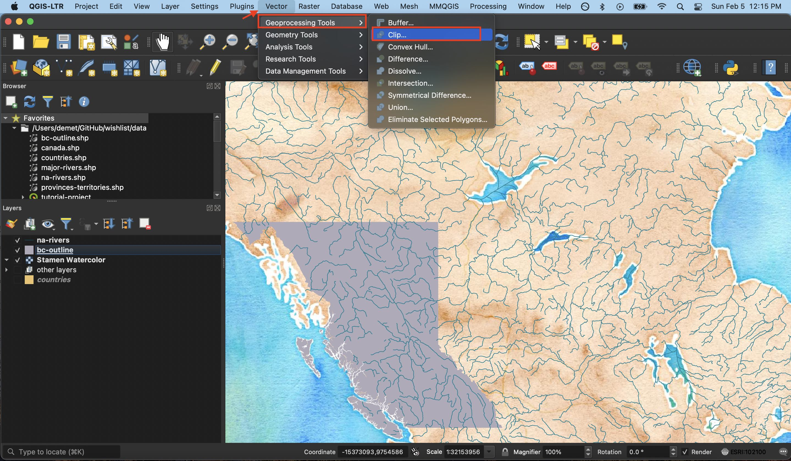
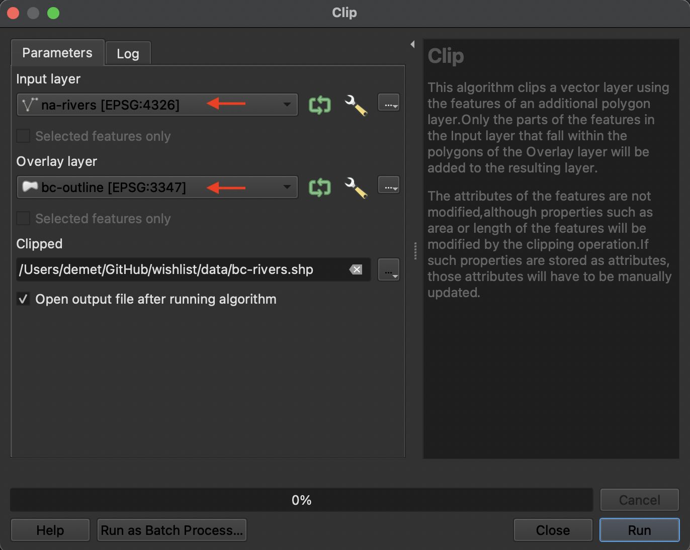
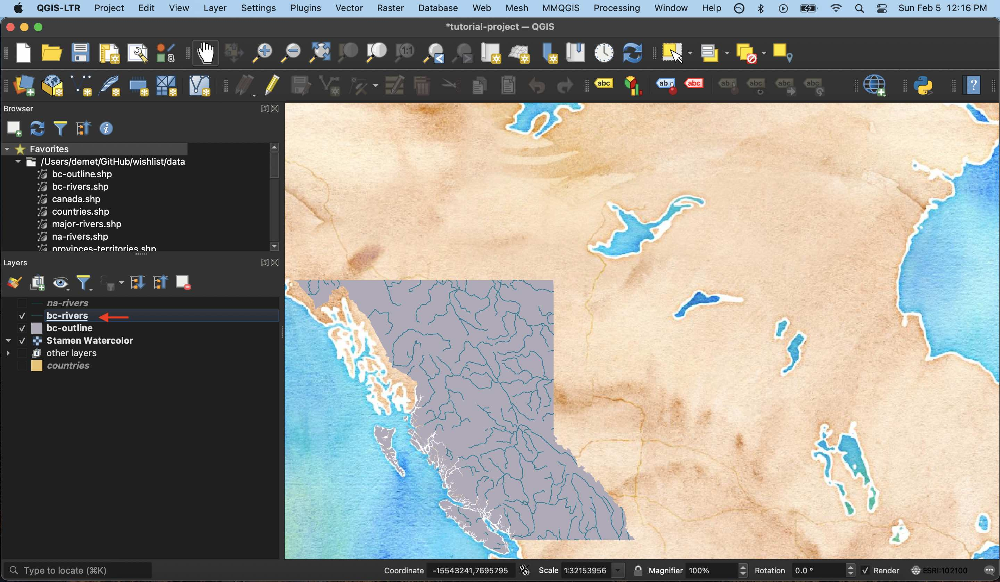

# Clip
If you have a shapefile that extends outside the bounds of your area of interest, you might find the clip tool useful. The clip tool takes one shapefile and trims it to the extent of another feature. (Think of the clip tool like cutting a sheet of dough with a cookie cutter. The sheet of dough is the shapefile you want to trim and the cookie cutter is the feature whose shape you trim it to.) Another reason you might clip a shapefile is if it takes up a lot of processing power to render and you don't need it to be so big. For example, if you're working with rivers in British Columbia, you may not need to render rivers for the whole of North America, or even Canada. 

## How To
From the **Vector** menu at the top of your screen, navigate to the **Geoprocessing** sub-menu and select **Clip.** 

The Input Layer is the layer you want to trim and the Overlay Layer is the extent you want to clip it to. To save the output file as a permanent shapefile, click the ... to give it a name and location. Hit run to run the clip tool. 
</img>
   
Return to your map canvas. Hide or remove your input layer to see the results of your clip.

    
