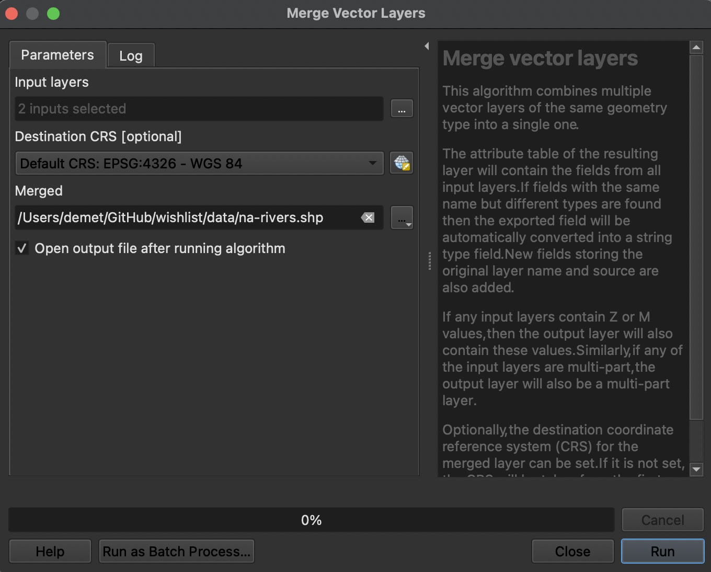

# Merge
Merge is useful when you have two vector layers of the same geometry type (points, lines, polygons) and you want to combine them into one shapefile. For instance, two layers that render the same kind of think but provide different levels of detail. This demonstration merges a layer of major rivers with a layer providing more detailed rivers for North America. Both datasets were downloaded from Natural Earth (see data.md for more details). 
    

From the **Vector** menu at the top of your screen, navigate to the Data Management Tools sub-menu and click on the **Merge Vector Layers** tool. 

In the dialogue box, click the ... next to Input Layers to select the layers you wish to merge together. This tool will create a new file with your inputs merged together. Your original files will not be altered. Click the < arrow to return to the dialogue box. Select the CRS (coordinate reference system) you wish your new file to be in. If you'd like to save the output as a permanent file, give it a location and name now. Make sure the output file type is set to ESRI shapefile. Click run. 

    

Return to your map canvas. Hide or remove your individual shapefiles to see the result of your merge. 

